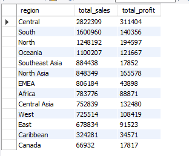
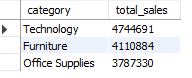
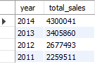
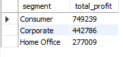

```markdown
#  Global Superstore Sales Analysis

##  Project Overview

Sales analysis of the Global Superstore dataset (51K rows) using Excel, SQL and Power BI. The goal was to identify top performing regions, categories, customer segments and loss-making products to support data-driven business decisions.

---

##  Tools Used

| Tool | Purpose |
|---|---|
| Excel | Data Cleaning & Preprocessing |
| SQL (MySQL) | Data Analysis & Business Querying |
| Power BI | Dashboard & Visualization |

---

## Dataset

| Detail | Info |
|---|---|
| File | global_superstore_sales.csv |
| Source | Kaggle - Superstore Sales Dataset |
| Author | Aditi Saxena |
| Rows | 51,290 |
| Columns | 21 |
| Years | 2011–2014 |
| Coverage | Global sales across 13 regions |

---

## 🧹 Data Cleaning (Excel)

- Removed duplicate rows
- Handled null/missing values
- Corrected data types (dates, numbers)
- Standardized column names for MySQL import

---

##  SQL Queries & Business Analysis

### Q1: Sales & Profit by Region

**Business Goal:** Identify which regions generate the most revenue and profit to prioritize marketing budget and sales team allocation.

```sql
SELECT region,  
ROUND(SUM(sales),2) AS total_sales,  
ROUND(SUM(profit),2) AS total_profit  
FROM sales_project  
GROUP BY region  
ORDER BY total_sales DESC;
```

**Finding:** Central region leads with $2.8M in sales.

**Business Insight:** Central region should receive increased inventory investment. Regions with low profit margins despite high sales may indicate discount over-usage or high shipping costs — needs further investigation.





---

### Q2: Sales by Category

**Business Goal:** Understand which product categories drive the most revenue to guide product portfolio decisions.

```sql
SELECT category,  
ROUND(SUM(sales),2) AS total_sales  
FROM sales_project  
GROUP BY category  
ORDER BY total_sales DESC;
```

**Finding:** Technology is the top category at $4.7M.

**Business Insight:** Technology dominates sales — the business should ensure consistent stock availability and explore upselling opportunities within this category.




---

### Q3: Sales by Year

**Business Goal:** Track year-over-year growth to evaluate business performance trends and forecast future revenue.

```sql
SELECT year,  
ROUND(SUM(sales),2) AS total_sales  
FROM sales_project  
GROUP BY year  
ORDER BY total_sales DESC;
```

**Finding:** Sales grew 90% from 2011 to 2014.

**Business Insight:** Consistent growth over 4 years indicates strong market expansion. This trend supports increased investment in scaling operations.





---

### Q4: Profit by Segment

**Business Goal:** Identify the most profitable customer segments to focus retention and loyalty strategies.

```sql
SELECT segment,  
ROUND(SUM(profit),2) AS total_profit  
FROM sales_project  
GROUP BY segment  
ORDER BY total_profit DESC;
```

**Finding:** Consumer segment most profitable at $749K.

**Business Insight:** Consumer segment should be the primary target for loyalty programs and personalized marketing campaigns to protect and grow this revenue stream.





---

### Q5: Loss Making Products

**Business Goal:** Identify products causing financial losses to review pricing strategy and avoid margin erosion.

```sql
SELECT product_name,  
ROUND(SUM(profit),2) AS total_profit  
FROM sales_project  
WHERE profit < 0  
GROUP BY product_name  
ORDER BY total_profit ASC  
LIMIT 10;
```

**Finding:** Cubify 3D Printer biggest loss at -$9,240.

**Business Insight:** Loss-making products may be priced below cost or heavily discounted. Immediate action needed — either reprice, discontinue, or negotiate better supplier rates.


---

##  Key Findings

| # | Finding | Business Impact |
|---|---|---|
| 1 | Central region highest sales ($2.8M) | Prioritize resource allocation here |
| 2 | Technology top category ($4.7M) | Expand tech product portfolio |
| 3 | Sales grew 90% (2011–2014) | Strong growth trajectory |
| 4 | Consumer segment most profitable ($749K) | Focus retention strategies |
| 5 | Cubify 3D Printer biggest loss (-$9,240) | Urgent pricing review needed |

---

##  Power BI Dashboard


---

##  Conclusion

This analysis reveals that the Central region and Technology category are the primary revenue drivers. The Consumer segment delivers the highest profitability, making it a key target for retention strategies. The consistent 90% sales growth from 2011 to 2014 signals strong business momentum.

However, products like Cubify 3D Printer are generating significant losses, indicating potential pricing or discount policy issues that require immediate review. These insights can directly inform inventory planning, marketing budget allocation, and product strategy decisions.
```

