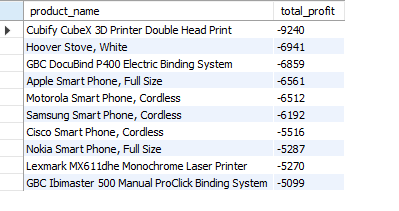
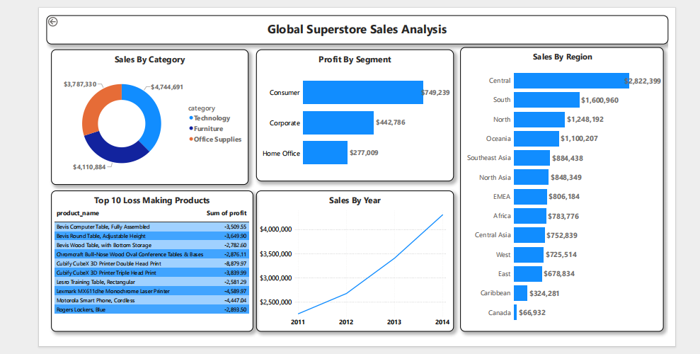

#  Global Superstore Sales Analysis

##  Project Overview
Sales analysis of Global Superstore dataset (51K rows) using SQL, Excel and Power BI. The goal was to identify top performing regions, categories, customer segments and loss making products.

##  Tools Used
- **Excel** — Data Cleaning
- **SQL (MySQL)** — Data Analysis  
- **Power BI** — Dashboard & Visualization

##  Dataset
- 51,290 rows | 21 columns
- Years: 2011–2014
- Global sales data across 13 regions

## SQL Queries & Analysis

### Q1: Sales & Profit by Region
```sql
SELECT region,
ROUND(SUM(sales),2) AS total_sales,
ROUND(SUM(profit),2) AS total_profit
FROM sales_project
GROUP BY region
ORDER BY total_sales DESC;

Finding: Central region leads with $2.8M sales


### Q2: Sales by Category
SELECT category,
ROUND(SUM(sales),2) AS total_sales
FROM sales_project
GROUP BY category
ORDER BY total_sales DESC;

Finding: Technology is top category at $4.7M


### Q3: Sales by Year
SELECT year,
ROUND(SUM(sales),2) AS total_sales
FROM sales_project
GROUP BY year
ORDER BY total_sales DESC;

Finding: Sales grew 90% from 2011 to 2014


### Q4: Profit by Segment
SELECT segment,
ROUND(SUM(profit),2) AS total_profit
FROM sales_project
GROUP BY segment
ORDER BY total_profit DESC;

Finding: Consumer segment most profitable at $749K


### Q5: Loss Making Products
SELECT product_name,
ROUND(SUM(profit),2) AS total_profit
FROM sales_project
WHERE profit < 0
GROUP BY product_name
ORDER BY total_profit ASC
LIMIT 10;

Finding: Cubify 3D Printer biggest loss at -$9,240



## Key Findings
* Central region has highest sales ($2.8M)
* Technology is top selling category ($4.7M)
* Sales grew 90% from 2011 to 2014
* Consumer segment most profitable ($749K)
* Cubify 3D Printer biggest loss maker (-$9,240)

## Dashboard


##Conclusion
This analysis reveals that the Central region and Technology category drive the most revenue. Consumer segment is the most profitable customer group. Sales showed consistent growth from 2011 to 2014. However, certain products like Cubify 3D Printer and Smartphones are generating losses and require pricing strategy review.


